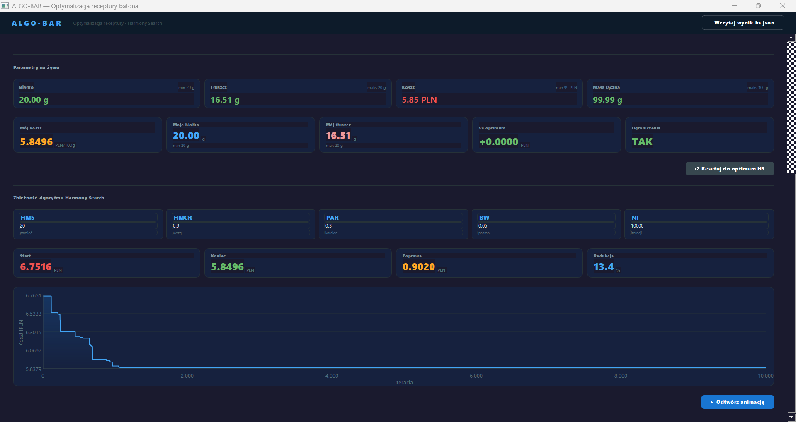
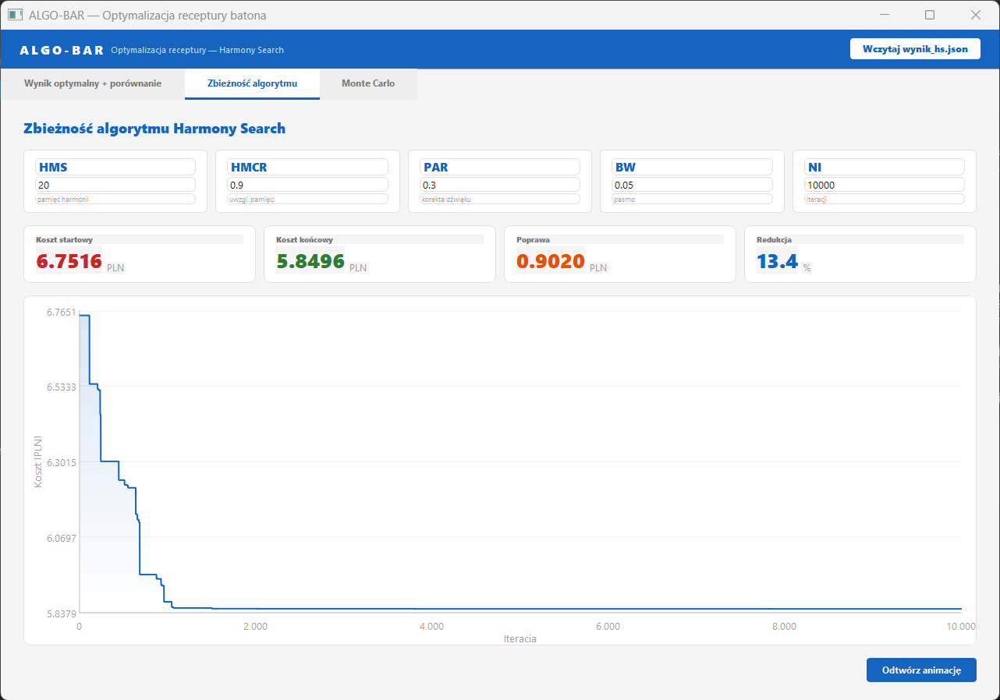
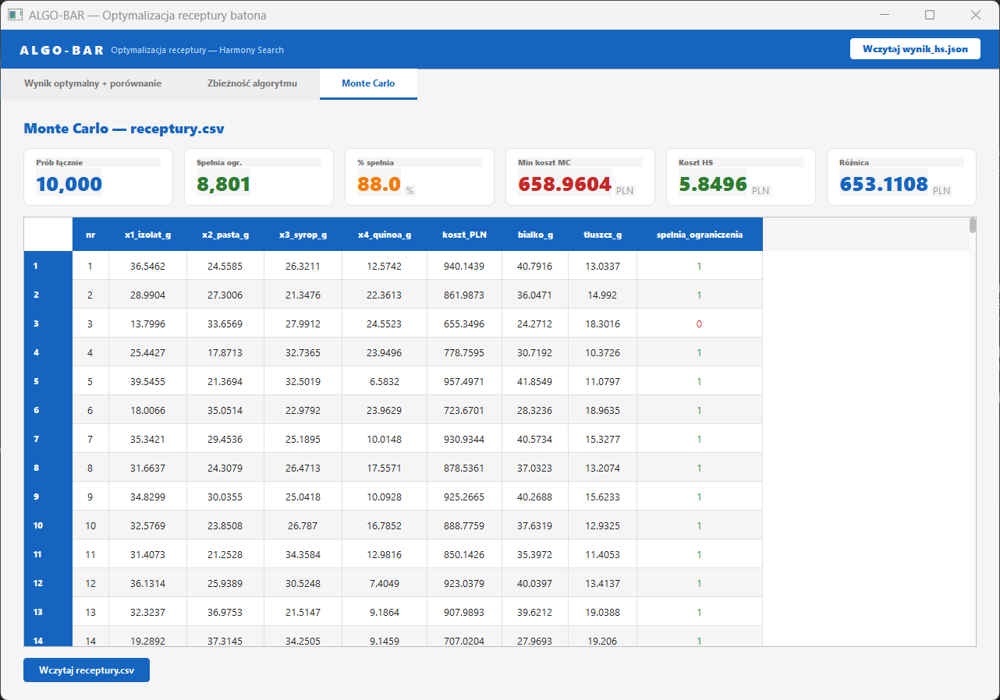
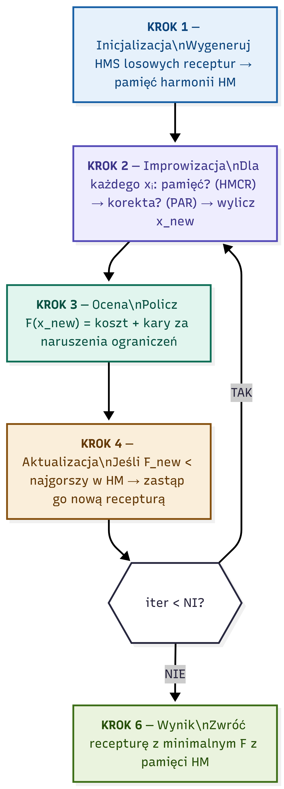

# Optymalizacja Receptury Batona ALGO-BAR


---

### 1. Cel projektu

Minimalizacja całkowitego kosztu surowców przy zachowaniu wytycznych dietetycznych oraz technologicznych. Model uwzględnia fizyczne ograniczenia składników, aby zapewnić właściwą konsystencję i smak produktu końcowego.

---

### 2. Parametry surowców (na 100 g)

| Składnik | Symbol | Białko (%) | Tłuszcz (%) | Cena (PLN/100 g) |
| :--- | :---: | :---: | :---: | :---: |
| Izolat serwatki | $x_1$ | 90 | 0 | 18.00 |
| Pasta orzechowa | $x_2$ | 25 | 50 | 6.00 |
| Syrop ryżowy | $x_3$ | 0 | 0 | 2.50 |
| Ekspandowana quinoa | $x_4$ | 14 | 6 | 5.50 |

---

### 3. Założenia technologiczne (zakresy masy)

Limity dolne i górne zapobiegają błędom strukturalnym batona (nadmierna sypkość, brak kleistości):

| Składnik | Min [g] | Max [g] |
| :--- | :---: | :---: |
| Izolat serwatki ($x_1$) | 10 | 40 |
| Pasta orzechowa ($x_2$) | 15 | 40 |
| Syrop ryżowy ($x_3$) | 15 | 35 |
| Ekspandowana quinoa ($x_4$) | 5 | 25 |

Ograniczenia dietetyczne: **białko ≥ 20 g**, **tłuszcz ≤ 20 g**, **suma mas = 100 g**.

---

### 4. Algorytm optymalizacji — Harmony Search

Optymalizacja realizowana jest metodą **Harmony Search (HS)** — algorytmem metaheurystycznym wzorowanym na improwizacji muzycznej. Zaimplementowany w czystym Pythonie z użyciem NumPy.

Pełny opis matematyczny z wyprowadzeniem wzorów, pseudokodem i weryfikacją wyników dostępny jest w pliku [`algobar_hs.pdf`](algobar_hs.pdf).

#### Parametry algorytmu

| Parametr | Symbol | Wartość | Opis |
| :--- | :---: | :---: | :--- |
| Rozmiar pamięci harmonii | HMS | 20 | Liczba rozwiązań przechowywanych w pamięci |
| Współczynnik uwzględnienia pamięci | HMCR | 0.90 | Prawdopodobieństwo losowania z pamięci |
| Współczynnik korekty dźwięku | PAR | 0.30 | Prawdopodobieństwo perturbacji wartości |
| Szerokość pasma | BW | 0.05 | Maksymalna korekta (% zakresu zmiennej) |
| Liczba improwizacji | NI | 10 000 | Liczba iteracji algorytmu |

#### Schemat działania

```
Krok 1 — Inicjalizacja HM
         Wypełnij pamięć HMS=20 losowymi recepturami spełniającymi ograniczenia

Krok 2 — Improwizacja nowej harmonii
         Dla każdego składnika x_i:
           z prawdop. HMCR → pobierz wartość z pamięci HM
             z prawdop. PAR  → lekko skoryguj ±BW
           z prawdop. 1-HMCR → losuj z pełnego zakresu [min, max]

Krok 3 — Aktualizacja pamięci
         Jeśli koszt nowej receptury < najgorszy koszt w HM
           → zastąp najgorsze rozwiązanie w HM

Krok 4 — Powtórz NI = 10 000 razy kroki 2–3

Krok 5 — Zwróć najlepsze rozwiązanie z HM → wynik_hs.json
```

#### Przepływ danych

```
generator.py      →   receptury.csv     (10 000 prób Monte Carlo)

hs_algobar.py     →   wynik_hs.json     (wynik optymalizacji HS)
                  →   hm_inicjalizacja.csv

wynik_hs.json
receptury.csv     →   gui_algobar.py    (wizualizacja PyQt5)
```

---

### 5. Generator danych losowych

Plik `generator.py` generuje 10 000 losowych receptur metodą Monte Carlo i zapisuje je do `receptury.csv`. Dane służą jako **punkt odniesienia** do porównania z wynikiem Harmony Search.

| Kolumna | Opis |
| :--- | :--- |
| `izolat_g` | masa izolatu serwatki [g] |
| `pasta_g` | masa pasty orzechowej [g] |
| `syrop_g` | masa syropu ryżowego [g] |
| `quinoa_g` | masa quinoa [g] |
| `koszt_PLN` | całkowity koszt receptury [PLN/100 g] |
| `bialko_g` | zawartość białka [g/100 g] |
| `tluszcz_g` | zawartość tłuszczu [g/100 g] |
| `poprawny` | 1 = spełnia ograniczenia, 0 = narusza |

---

### 6. GUI — PyQt5

Interfejs graficzny `gui_algobar.py` wczytuje `wynik_hs.json` oraz `receptury.csv`.

#### Zakładki

| Zakładka | Zawartość |
| :--- | :--- |
| **Wynik optymalny + porównanie** | Karty statystyk, tabela składu, paski porównawcze HS vs Monte Carlo, suwaki do interaktywnej zmiany składu z aktualizacją na żywo |
| **Zbieżność algorytmu** | Parametry HS, animowany wykres spadku kosztu przez NI iteracji |
| **Monte Carlo** | Tabela receptury.csv z podświetleniem najlepszego wyniku, statystyki porównawcze |

#### Uruchomienie

```bash
pip install PyQt5 numpy
python hs_algobar.py          # generuje wynik_hs.json
python generator.py           # generuje receptury.csv
python gui_algobar.py         # uruchamia GUI
```

---

### 7. Zrzuty ekranu

 
 

 
 

---

### 8. Struktura plików

```
├── generator.py            generator danych losowych (Monte Carlo)
├── hs_algobar.py           algorytm Harmony Search (Python + NumPy)
├── gui_algobar.py          interfejs graficzny (PyQt5)
├── algobar_hs.pdf          opis matematyczny algorytmu (LaTeX)
├── receptury.csv           10 000 losowych receptur
├── hm_inicjalizacja.csv    pamięć harmonii — rozwiązania startowe
└── wynik_hs.json           wynik optymalizacji HS
```